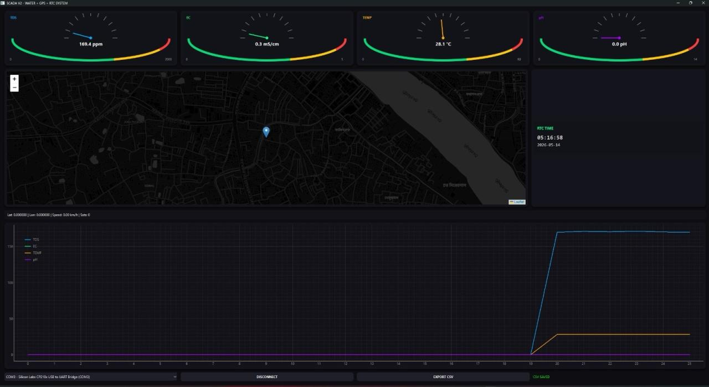
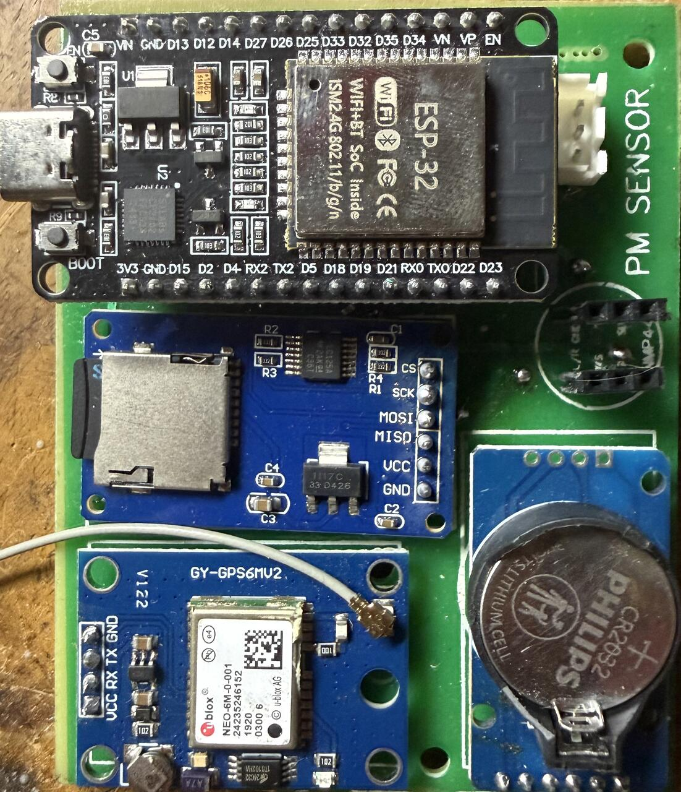
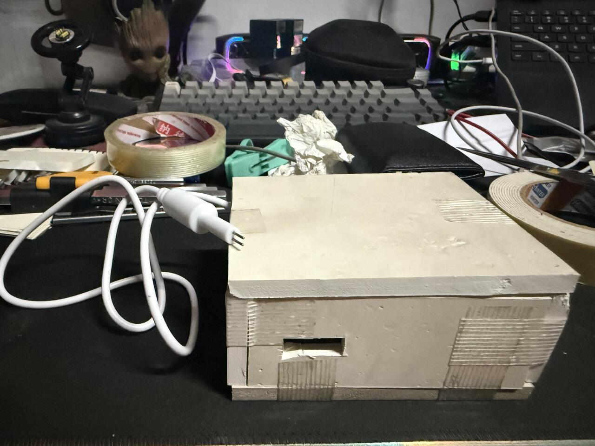
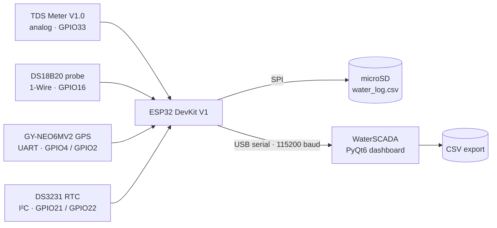
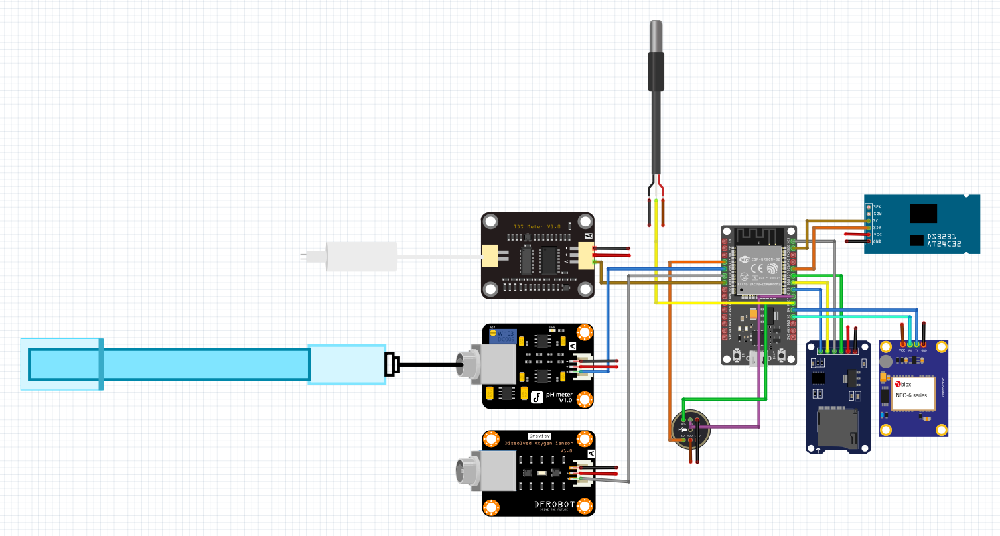

# WaterSCADA — ESP32 Water-Quality Logger

GPS-tagged water-quality logger built on an ESP32. It measures **TDS / EC** and **water temperature**, stamps every reading with **RTC time** and **GPS position**, logs it to a **microSD card**, and streams it over USB to **WaterSCADA** — a PyQt6 desktop dashboard with live gauges, a map and trend charts.




| Assembled board | Prototype enclosure |
| :---: | :---: |
|  |  |

---

## Features

- **Water quality** — TDS (ppm) and EC (mS/cm) from an analog TDS probe, 20-sample averaged ADC
- **Water temperature** — DS18B20 waterproof probe, 5-reading average
- **Location** — NEO-6M GPS: latitude, longitude, speed and satellite count
- **Time** — DS3231 RTC with coin-cell backup
- **Stand-alone logging** — every reading is appended to `water_log.csv` on the microSD card
- **Live dashboard** — animated gauges (TDS, EC, temperature, pH), dark map with GPS track, RTC clock, rolling trend chart, one-click CSV export
- **Windows app** — packaged as a single `WaterSCADA.exe` with PyInstaller

## How it works



Each cycle (about 8–9 s, mostly the 5-sample DS18B20 average) the firmware reads every sensor, appends a row to the SD card and prints one CSV line over USB. The dashboard parses that line and updates the gauges, map, clock and chart.

## Hardware

| Qty | Part | Used for |
| :-: | --- | --- |
| 1 | ESP32 DevKit V1 — 30-pin, ESP32-WROOM-32, CP210x USB-UART | Controller |
| 1 | TDS Meter V1.0 board + TDS probe | TDS / EC |
| 1 | DS18B20 waterproof probe + 10 kΩ resistor | Water temperature |
| 1 | GY-NEO6MV2 (u-blox NEO-6M) + antenna | Position and speed |
| 1 | DS3231 RTC module + CR2032 cell | Timestamps |
| 1 | MicroSD card module (SPI) + FAT32 microSD card | Local logging |
| 1 | Carrier PCB and enclosure | Mounting |

### Wiring

Pin map, as used by the firmware and drawn in the Fritzing diagram:

| Module | Module pin | ESP32 pin | Notes |
| --- | --- | --- | --- |
| TDS Meter V1.0 | A | GPIO33 (D33) | ADC1 channel 5 |
| DS18B20 | DQ | GPIO16 (RX2) | 10 kΩ pull-up to 3V3 |
| GY-NEO6MV2 | TX | GPIO4 (D4) | UART1 RX, 9600 baud |
| GY-NEO6MV2 | RX | GPIO2 (D2) | UART1 TX |
| DS3231 | SDA / SCL | GPIO21 / GPIO22 | I²C |
| microSD | CS / SCK / MISO / MOSI | GPIO5 / GPIO18 / GPIO19 / GPIO23 | SPI (VSPI) |

**Power (recommended):** common GND for everything. Run the DS18B20 (and its pull-up), the DS3231 and the TDS board from **3V3**. The microSD module has an onboard AMS1117 regulator, so feed it **5 V from VIN**. The GY-NEO6MV2 accepts 3.3–5 V.



> [!NOTE]
> The Fritzing file [`Diagram/water monitor.fzz`](Diagram/water%20monitor.fzz) also includes a DFRobot pH meter (SEN0161, A → GPIO35), a DFRobot Gravity dissolved-oxygen sensor (SEN0237-A, A → GPIO32) and an INMP441 I²S microphone. The current firmware does not read them yet, so the dashboard's pH gauge stays at 0.0.

## Repository layout

```text
├── Code for Arduino/
│   └── waaterloggerpython/
│       └── waaterloggerpython.ino   ESP32 firmware
├── Diagram/
│   └── water monitor.fzz            Fritzing wiring diagram
├── Images/                          photos, dashboard screenshot, wiring diagram
├── main.py                          WaterSCADA dashboard (PyQt6)
├── WaterSCADA.spec                  PyInstaller build recipe
├── app.ico                          application icon
├── requirements.txt                 Python dependencies
└── LICENSE
```

## Getting started

### 1. Flash the firmware

1. Install **Arduino IDE 2.x** and add ESP32 support: *Boards Manager →* **esp32** by Espressif Systems.
2. From *Library Manager*, install:
   - **RTClib** by Adafruit (accept the *Adafruit BusIO* dependency)
   - **TinyGPSPlus** by Mikal Hart
   - **OneWire**
   - **DallasTemperature** by Miles Burton

   `SD`, `SPI`, `Wire` and `HardwareSerial` come with the ESP32 core.
3. Open [`Code for Arduino/waaterloggerpython/waaterloggerpython.ino`](Code%20for%20Arduino/waaterloggerpython/waaterloggerpython.ino).
4. Select *Tools → Board →* **ESP32 Dev Module** (or *DOIT ESP32 DEVKIT V1*), pick the COM port and click **Upload**.
5. Insert a FAT32 microSD card and open the Serial Monitor at **115200 baud**. You should see `SYSTEM READY`, then a reading every few seconds.

**Setting the RTC.** The sketch only reads the DS3231. To set it from your PC clock, add this line in `setup()` right after `rtc.begin()`, upload once, then delete the line and upload again (otherwise every reset rewinds the clock to the compile time):

```cpp
rtc.adjust(DateTime(F(__DATE__), F(__TIME__)));
```

### 2. Run the dashboard

Needs Python 3.10 or newer (developed on Python 3.14, Windows).

```powershell
python -m venv .venv
.venv\Scripts\activate
pip install -r requirements.txt
python main.py
```

1. Plug in the ESP32 **before** starting the app — the COM-port list is read at launch.
2. Pick the port (for example `COM3 - Silicon Labs CP210x USB to UART Bridge`) and click **CONNECT ESP32**.
3. **EXPORT CSV** saves everything received in the session. **Esc** toggles full screen.

The map (Leaflet with CARTO dark tiles) needs an internet connection; everything else works offline.

### 3. Build the Windows executable (optional)

```powershell
pip install pyinstaller
pyinstaller WaterSCADA.spec
```

The single-file app is written to `dist/WaterSCADA.exe` (about 230 MB, because it bundles Qt WebEngine for the map). A prebuilt copy is on the [Releases](../../releases) page.

## Data formats

**USB serial (115200 baud).** Each cycle prints a readable block followed by one CSV line, which is what the dashboard parses:

| Field | Unit / format | Notes |
| --- | --- | --- |
| `tds` | ppm | |
| `ec` | mS/cm | |
| `temp` | °C | `0.00` if the DS18B20 is not detected |
| `ph` | — | always `0.00` for now |
| `time` | `YYYY-MM-DD HH:MM:SS` | from the DS3231 |
| `lat`, `lon` | degrees | `0.000000` until the GPS has a fix |
| `speed` | km/h | |
| `sats` | count | satellites used in the fix |

Example line:

```text
169.40,0.34,28.12,0.00,2026-05-14 05:16:58,0.000000,0.000000,0.00,0
```

**microSD card (`/water_log.csv`).** Columns `Time,ADC,Voltage,EC,TDS,Temp,Lat,Lon,Speed,Sats`, one row per cycle. The raw ADC value and probe voltage are kept so the data can be recalibrated later.

**Dashboard export.** Columns `Time,TDS,EC,TEMP,pH,RTC,Lat,Lon,Speed,Sats`. `Time` is the PC clock; `RTC` is the logger's clock.

## TDS / EC calculation

```text
V   = ADC × 3.3 / 4095                             mean of 20 samples, 12-bit ADC
EC  = (133.42·V³ − 255.86·V² + 857.39·V) / 1000    mS/cm
TDS = EC × 500                                     ppm (conversion factor 0.5)
```

The cubic is the standard curve for DFRobot-style analog TDS boards.

**Known limitations**

- EC and TDS are not temperature-compensated yet (values are not normalised to 25 °C).
- `analogRead()` returns raw ESP32 ADC counts, which are non-linear; calibrate against a reference solution for accurate numbers.
- pH is a placeholder in the firmware (always 0.0).

## Troubleshooting

| Problem | Fix |
| --- | --- |
| No COM port in the app | Install the Silicon Labs CP210x driver, plug in the board, then restart the app |
| Upload fails with `Failed to connect to ESP32` | Hold **BOOT** when `Connecting...` appears. GPIO2 (GPS RX) is a boot-strapping pin, so unplug the GPS if it keeps failing |
| GPS stays at `0.000000` with 0 satellites | It needs open sky, and a cold start can take a few minutes. Check GPS TX → GPIO4 and RX → GPIO2 |
| Temperature shows `Not detected` or 0 °C | Check the probe wiring and the 10 kΩ pull-up between DQ and 3V3 |
| `SD Failed` at boot | Use a FAT32 card, check CS on GPIO5, and power the module from 5 V |
| RTC shows `2000-01-01` | Set the clock (see *Setting the RTC*) |
| Map is blank | The map tiles load from the internet |

## Author

**Md. Mahin Rahman** — [@thisisdibbo](https://github.com/thisisdibbo) · [mr.d2003feb@gmail.com](mailto:mr.d2003feb@gmail.com)\
Department of Electrical and Electronic Engineering, Islamic University of Technology (IUT), Gazipur, Bangladesh

## License

Released under the [MIT License](LICENSE).
